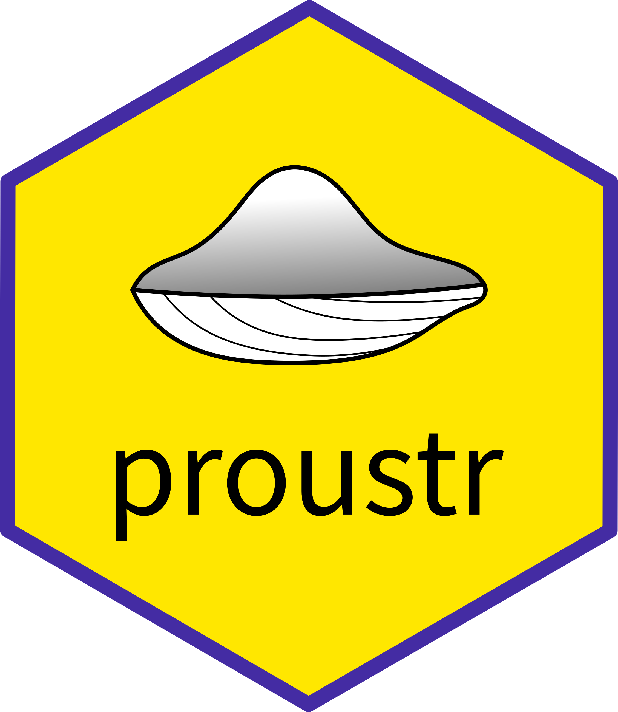
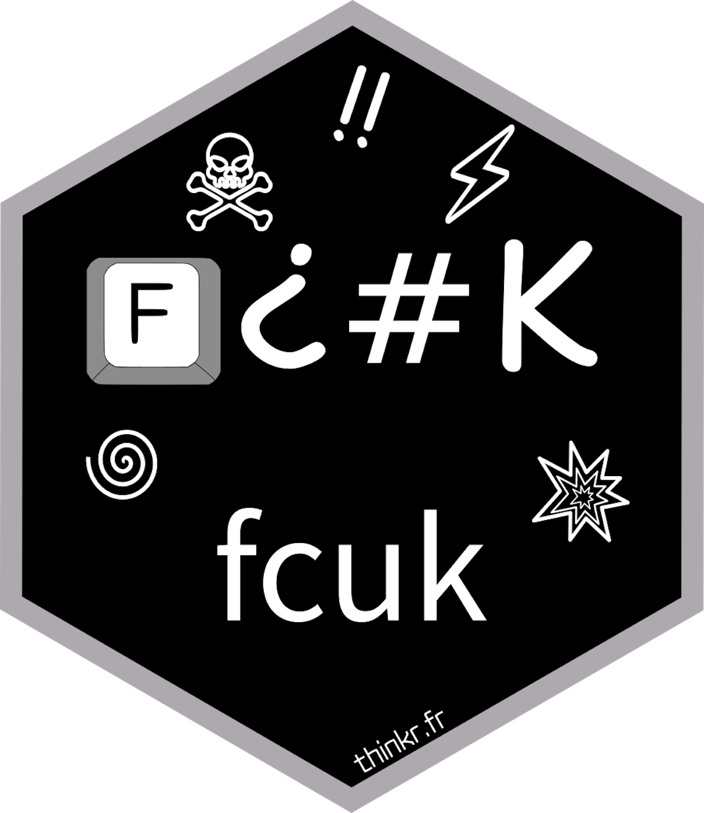
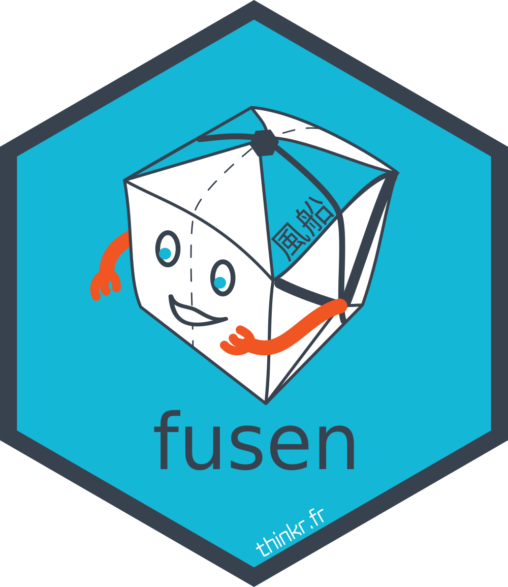
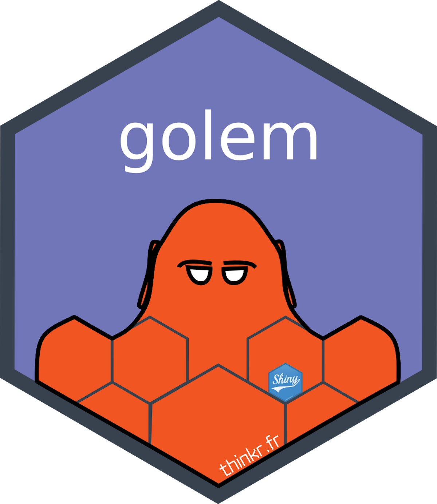
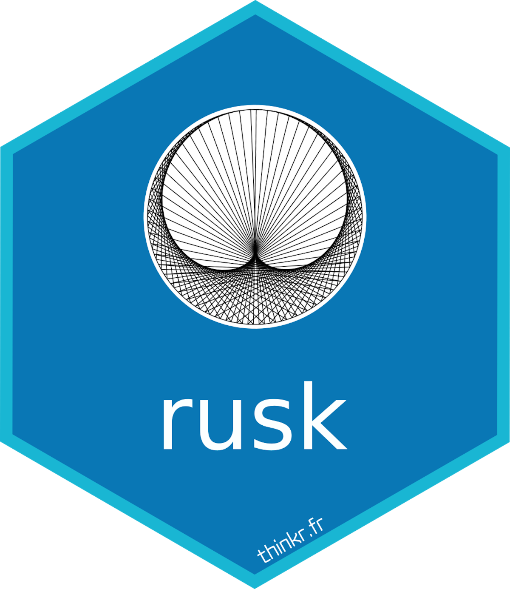
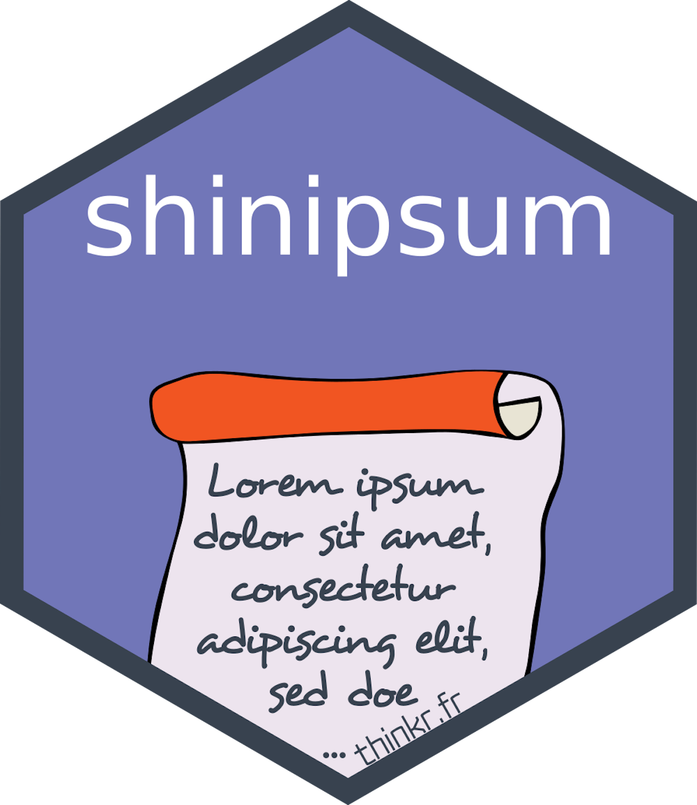
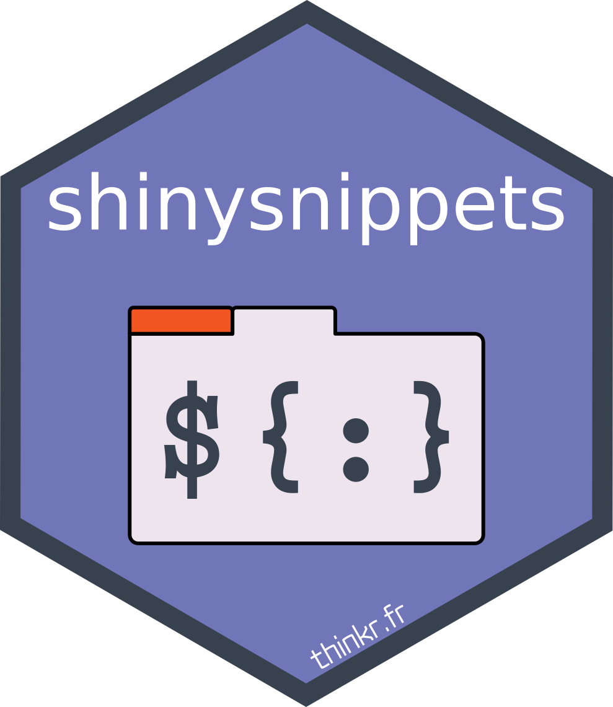

<!-- README.md is generated from README.Rmd. Please edit that file -->

# visuals

HQ hex and visuals for ThinkR projects

<!-- badges: start -->

<!-- badges: end -->

## PNG hex

<!-- code from @hadley: https://github.com/rstudio/hex-stickers/blob/master/PNG/README.Rmd -->

*Hexes drawn by [@statnmap](https://github.com/statnmap).*
